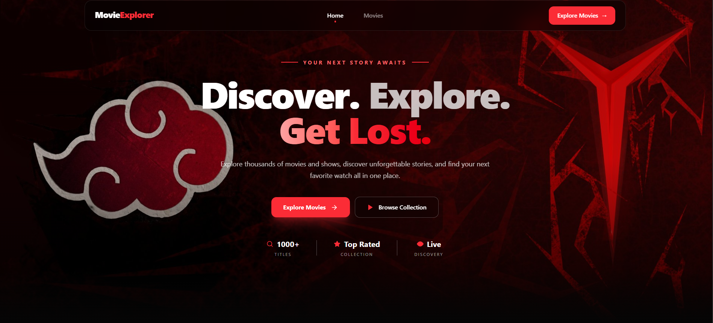

# 🎬 MovieExplorer



> **Discover. Explore. Get Lost.**

A modern and responsive movie & TV show discovery application built with **React** and **JavaScript**. MovieExplorer lets users browse titles, search for movies and shows, and explore detailed information through a cinematic interface.

---

## ✨ About The Project

MovieExplorer was created as a movie discovery experience where finding something interesting to watch feels simple and engaging.

The application uses the **TVMaze API** to fetch real-time show data and provides:

* 🔎 Dynamic title search
* 🎬 Movie & TV show browsing
* ⭐ Ratings
* 📅 Release information
* 🏷️ Genres
* 📖 Show summaries
* 👁️ Detailed information modal
* 📱 Responsive design
* 🎞️ Smooth UI animations

---

## 🚀 Features

### 🏠 Home Page

The landing page includes:

* Cinematic hero section
* MovieExplorer branding
* Short project introduction
* Call-to-action buttons
* Feature sections
* Responsive layout
* Animated interface elements

### 🎥 Movie Listing

The Movies page provides a complete collection experience.

Users can:

* Browse available shows
* Search by title
* View poster images
* See release years
* See ratings
* See genres
* Open detailed information

### 🔍 Dynamic Search

MovieExplorer uses the TVMaze search API to dynamically search for titles.

Search requests use:

```text
https://api.tvmaze.com/search/shows?q=QUERY
```

The search results update automatically as the user searches.

### 📋 Movie Details

Clicking **See Details** opens a detailed modal containing:

* Poster
* Title
* Rating
* Release date
* Show type
* Runtime
* Genres
* Summary

The modal can be closed using the close button, outside click, or the `Escape` key.

### 📱 Responsive Design

The interface is designed for different screen sizes:

* 📱 Mobile
* 💻 Desktop
* 🖥️ Large screens

The movie collection automatically adapts its grid layout based on screen size.

---

## 🛠️ Technologies Used

| Technology    | Purpose                     |
| ------------- | --------------------------- |
| React         | Building the user interface |
| JavaScript    | Application logic           |
| React Router  | Page routing                |
| Tailwind CSS  | Styling & responsive design |
| Framer Motion | UI animations               |
| React Icons   | Interface icons             |
| TVMaze API    | Movie & TV show data        |
| Vite          | Development & build tool    |

---

## 🔌 API

MovieExplorer uses the free **TVMaze API** for show data.

### All Shows

```text
GET https://api.tvmaze.com/shows
```

### Search Shows

```text
GET https://api.tvmaze.com/search/shows?q=:query
```

Example:

```text
https://api.tvmaze.com/search/shows?q=girls
```

---

## 📂 Project Structure

```text
movie-explorer/
│
├── public/
│
├── src/
│   ├── assets/
│   │   ├── images/
│   │   ├── icons/
│   │   └── readme-banner.png
│   │
│   ├── components/
│   │   ├── Navbar.jsx
│   │   ├── Hero.jsx
│   │   ├── MovieCard.jsx
│   │   ├── MovieModal.jsx
│   │   └── Footer.jsx
│   │
│   ├── layouts/
│   │   └── MainLayout.jsx
│   │
│   ├── pages/
│   │   ├── Home.jsx
│   │   └── Movies.jsx
│   │
│   ├── routes/
│   │   └── router.jsx
│   │
│   ├── App.jsx
│   ├── main.jsx
│   └── index.css
│
├── .gitignore
├── eslint.config.js
├── index.html
├── package.json
├── package-lock.json
├── README.md
└── vite.config.js
```

---

## 🧭 Application Routes

| Route     | Page          |
| --------- | ------------- |
| `/`       | Home          |
| `/movies` | Movie Listing |

---

## ⚙️ Getting Started

### 1. Clone the repository

```bash
git clone YOUR_GITHUB_REPOSITORY_URL
```

### 2. Go to the project directory

```bash
cd movie-explorer
```

### 3. Install dependencies

```bash
npm install
```

### 4. Start the development server

```bash
npm run dev
```

Then open the local development URL shown by Vite.

---

## 🎨 Design Direction

MovieExplorer follows a dark cinematic visual style with:

* Deep black backgrounds
* Red accent colors
* Glassmorphism elements
* Cinematic imagery
* Rounded UI components
* Responsive layouts
* Smooth Framer Motion animations

The goal is to keep the interface visually immersive while maintaining a simple movie discovery experience.

---

## 🎯 Assignment Goals Covered

This project implements the main requirements of the Movie Explorer assignment:

* ✅ React application
* ✅ JavaScript
* ✅ Responsive design
* ✅ Navbar
* ✅ Hero banner
* ✅ Movie listing page
* ✅ Search functionality
* ✅ TVMaze API integration
* ✅ Reusable movie cards
* ✅ Movie poster
* ✅ Movie title
* ✅ Release year/date
* ✅ Rating
* ✅ See Details button
* ✅ Details modal
* ✅ Genre information
* ✅ Summary/overview
* ✅ Close modal functionality
* ✅ Footer
* ✅ React Router navigation

---

## 🌐 Live Project

**Live Website:**
`https://movie-explorer-eta-orpin.vercel.app`

**GitHub Repository:**
`https://github.com/Sifathossensuvo/movie-explorer`

---

## 👨‍💻 Developer

Built with curiosity, React, and a love for creating better web experiences.

**MovieExplorer — Discover your next story.**

---

## 📜 License

This project was created for educational purposes as part of a web development assignment.
